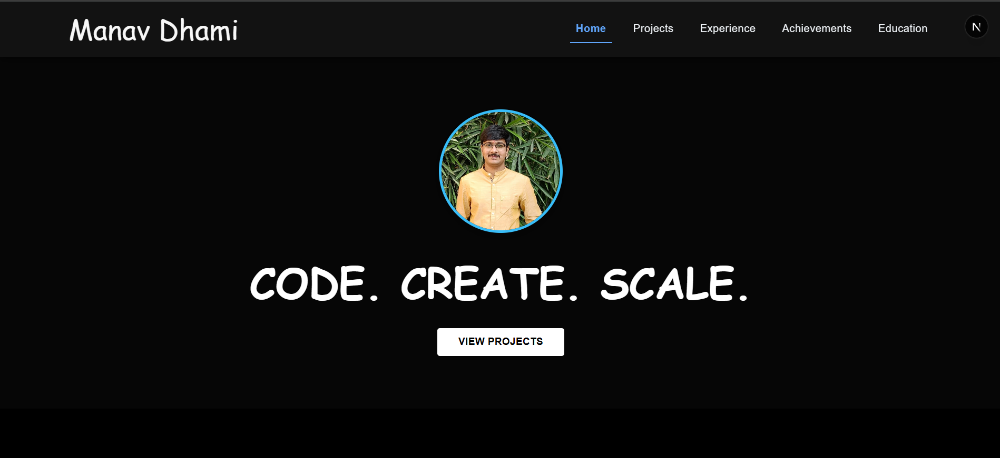

 # Manav Dhami 

Welcome to my personal developer portfolio! Built with **Next.js**, **MUI**, **Tailwind CSS**, and **Framer Motion**, this site showcases my **projects**, **skills**, **education**, **certifications**, and **achievements**—all in a creative, responsive interface.



---

## 📌 Features

- 🌐 **Modern Stack**: Built using **Next.js**, styled with **Tailwind CSS** and **Material UI**
- 🎨 **Smooth Animations**: Powered by **Framer Motion** for engaging transitions
- 💼 **Projects Section**: Highlights full-stack applications with live GitHub links
- 🧠 **Experience Timeline**: Visually appealing and responsive layout
- 🏆 **Achievements & Certifications**: Includes IEEE publication & contest rankings
- 🎓 **Education**: Clean, structured and logo-aligned academic journey
- 📱 **Responsive**: Fully functional on all screen sizes

---

## 🛠️ Tech Stack

| Frontend         | Styling               | Animation        | Deployment     |
|------------------|------------------------|------------------|----------------|
| React (Next.js)  | Tailwind CSS + MUI     | Framer Motion    | Vercel / Netlify |

---

---

## 🔗 Live Demo

> [https://manav-dhami.vercel.app/](https://your-portfolio-link.vercel.app)


## 📥 Installation & Run Locally

```bash
git clone https://github.com/Manav1026/portfolio.git
cd portfolio
npm install
npm run dev
```


